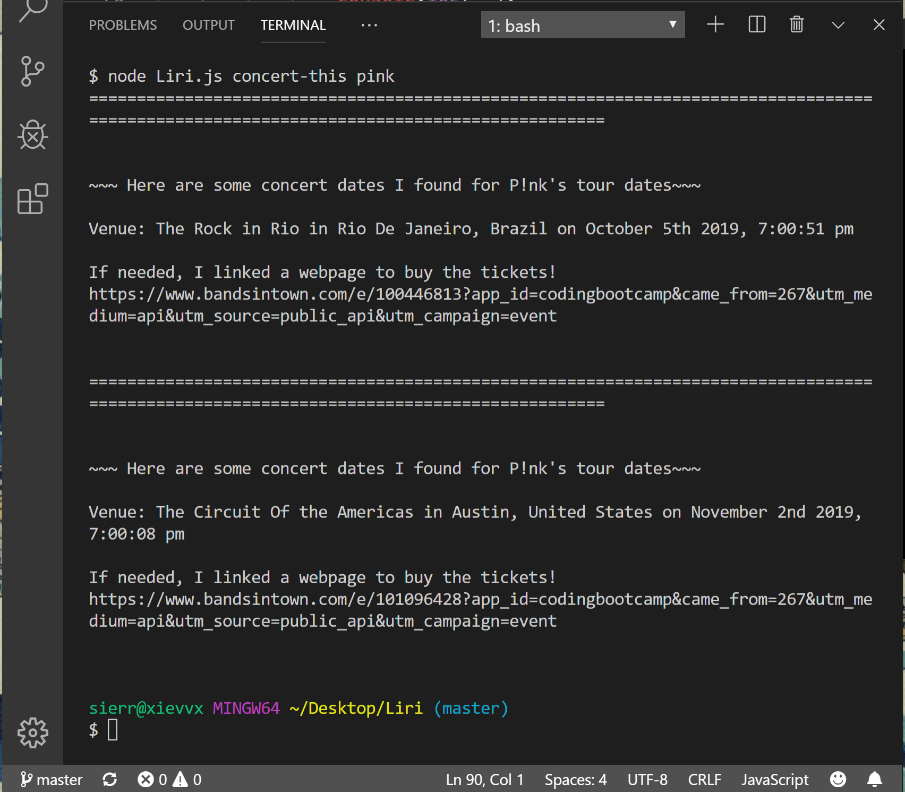
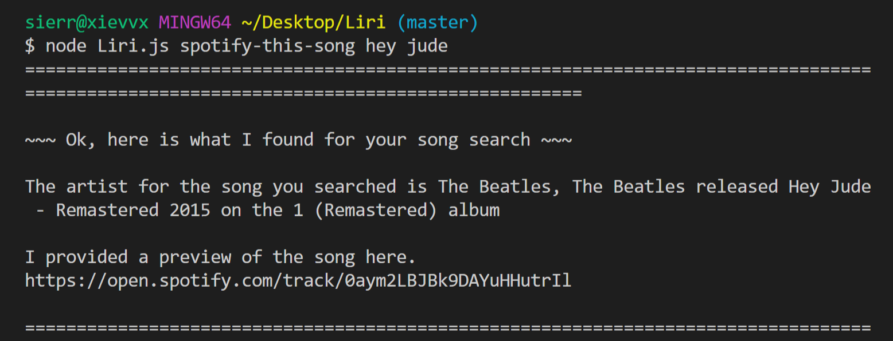
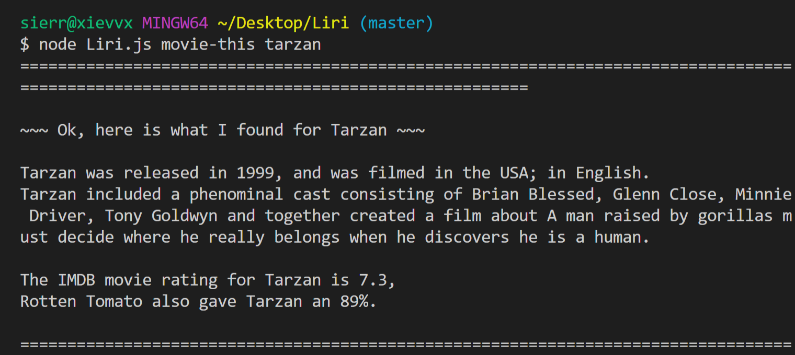
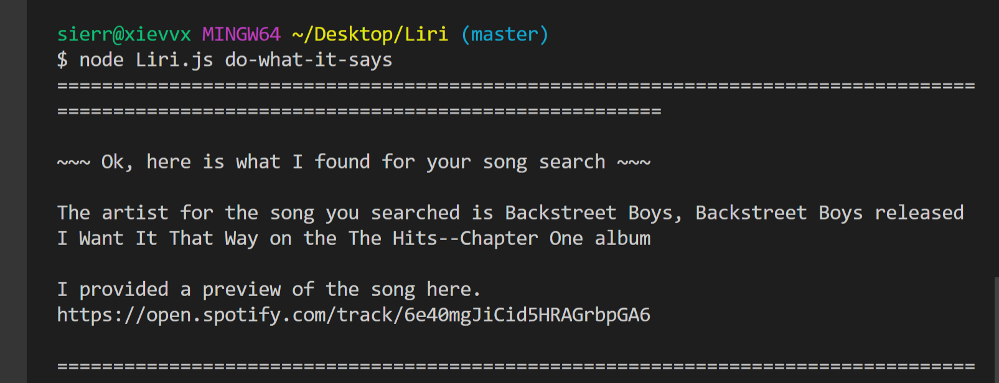

# **LIRI-Bot**

# **Overview:**
In this assignment, you will make LIRI. LIRI is like iPhone's SIRI. However, while SIRI is a Speech Interpretation and Recognition Interface, LIRI is a Language Interpretation and Recognition Interface. LIRI will be a command line node app that takes in parameters and gives you back data.

# 
# <h3>Liri's functionality and the different commands Liri will accept.</h3>
* concert-this
1. Open your terminal such as Bash.

2. Navigate to the folder that contains the liri.js file.

3. Run the concert-this command in the terminal. 

  $bg-green-light node liri.js concert-this {name of artist or band} $bg-green-light

* spotify-this-song

* move-this

* do-what-it-says

# <h2>Technologies used in Liri.</h2>
* Javascript
* Nodejs
* Node packages:
* Node-Spotify-API
* Request
* Moment
* DotEnv
# <h2>APIs used:</h2>
* Bands in Town
* OMDB
* Git
* GitHub

# <h6>Role in the app.</h6> 
Developer

